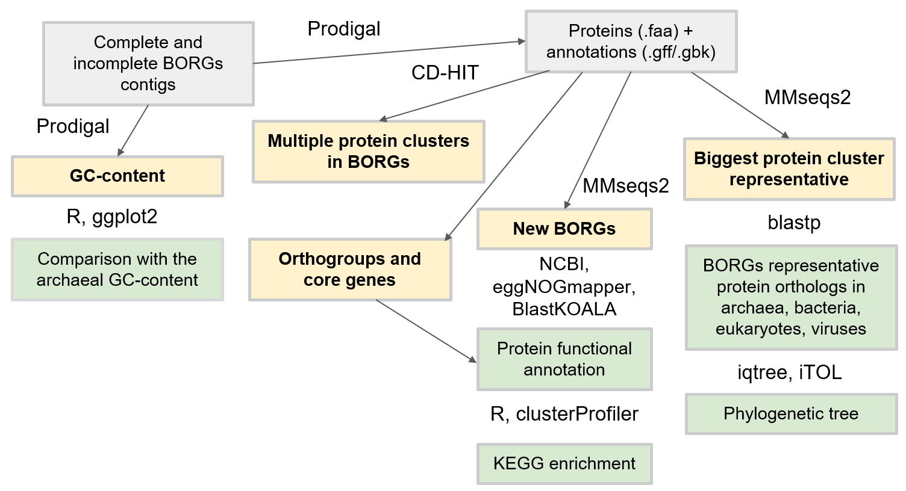

# Borgs - new entities in archaeal genomes?

This project was performed as a spring semester project in the [Bioinformatics Institute](https://bioinf.me/en) (academic year 2021-2022). 

Supervisors:
- Mikhail Rayko
- Lavrentii Danilov

Students: 
- Alexandra Kolodyazhnaya [@alvlako](https://github.com/alvlako)
- Vera Emelianenko [@Vera-Emelianenko](https://github.com/Vera-Emelianenko)  

## Introduction

In a preprint published on bioarchive in July 2021, authours describe misterious new entities in archeal genomes [(Al-Shayeb et al., 2021.)](https://www.biorxiv.org/content/10.1101/2021.07.10.451761v1.full). According to the authors, these genomic elements are associated with *Methanoperedens* archaea, range in size between ~6,5 - 9 Mb, contain mostly hypothetical proteins and share some structural features. Authours claim that this elements are neither plasmids nor viruses and at the same time they are not the part of the *Methanoperedens* chromosome. The definition of these elements is somewhat ambiguous. Authours define them them the following way: "We infer that these are a new type of archaeal extrachromosomal element with a distinct evolutionary origin. Gene sequence similarity, phylogeny, and local divergence of sequence composition indicate that many of their genes were assimilated from methane-oxidizing Methanoperedens archaea. We refer to these elements as “Borgs”". 

We used the Borgs sequences published in this paper along with the open-source metagenomic data to find out what are Borgs, how can they be defined and whether they have representatived in metagenomic data. 

## Goal and objectives 

The main goal of the project was to find, annotate and classify Borg-like entities from publicly available metagenomes.

## Workflow

## Materials and methods

### Data 

Genome sequences of Borgs and their annotated proteins were downloaded from https://ggkbase.berkeley.edu/BMp/organisms after registering on the databse website. 

### Nucleotide blast of Borg contigs

Complete borg genomes were blasted against the nr/nt database with 'blastn', using 'Archaea environmental samples (taxid:48510)' as organism.

### Analysing core genes

Orthologous genes were identified in all complete and near-complete Borgs with proteinortho 6.0.33, with the default parameters. The resulting table (`data/borgs.proteinortho.tsv`) was then filtered to contain only orthogroups present in 12 or more genomes, and these proteins were extracted from the fasta files using custom python scripts. Each orthogroup was aligned with MUSCLE v3.8.1551 with the default parameters (`data/alignments/group_0-75.afa.zip`). Only the alignments with > 60% identity were analysed.  

### Functional analysis of cluster proteins 

Cluster proteins were extracted with custom python scripts using the ncbi id and coordinates in identified clusters, and the obtained fasta file was annotated using the web-version of eggNOG-mapper (http://eggnog-mapper.embl.de/) (`data/cluster_proteins.emapper.annotations.tsv`). The same annotation was performed for the archeal metagenome proteins (`archaea_metagenomes_combined_lin.faa`, `microbiome_proteins.emapper.annotations.tsv`). KEGG enrichment analysis was performed in R using the enricher() function of the clusterProfiler package, with the default options, using archeal metagenome proteins + borg cluster proteins as a universe. Pie-chart visualisations were created using BlastKOALA (https://www.kegg.jp/blastkoala/) with Prokaryotes as taxonomy group and species_prokaryotes as KEGG GENES database. 

## Key results 

 - Found BORG-like spatial clusters of genes in archaeal metagenome contigs with MMseqs2 extension
 - Functionally annotated BORG-like spatial clusters
 - Identified and annotated BORG core genes
 - Clustered BORG proteins, retrieved homologs from other domains of life and built phylogeny

## Conclusions

 - BORGs seem to be distinct entities, related to archaea but separated from them some time ago.
 - The signatures of BORGs are mostly metabolic genes (clusters)
 - The Borgs’ signatures and structure are conserved to the extent allowing to find new putative Borgs

## Further plans

## References 

Borgs are giant extrachromosomal elements with the potential to augment methane oxidation
Al-Shayeb, B., Schoelmerich, M. C., West-Roberts, J., Valentin-Alvarado, L. E., Sachdeva, R., Mullen, S., ... & Banfield, J. F. 
bioRxiv (2021). https://doi.org/10.1101/2021.07.10.451761

ggKbase: https://ggkbase.berkeley.edu/

Database resources of the national center for biotechnology information.
Sayers, Eric W., Tanya Barrett, Dennis A. Benson, Evan Bolton, Stephen H. Bryant, Kathi Canese, Vyacheslav Chetvernin et al.
Nucleic acids research 39, no. suppl_1 (2010): D38-D51. DOI: 10.1093/nar/gkab1112

MUSCLE: multiple sequence alignment with high accuracy and high throughput. 
Edgar, R.C., 2004. 
Nucleic acids research, 32(5), pp.1792-1797. doi: 10.1093/nar/gkh340

eggNOG-mapper v2: functional annotation, orthology assignments, and domain 
prediction at the metagenomic scale. Carlos P. Cantalapiedra, 
Ana Hernandez-Plaza, Ivica Letunic, Peer Bork, Jaime Huerta-Cepas. 2021.
Molecular Biology and Evolution, msab293, https://doi.org/10.1093/molbev/msab293

eggNOG 5.0: a hierarchical, functionally and phylogenetically annotated
orthology resource based on 5090 organisms and 2502 viruses. Jaime
Huerta-Cepas, Damian Szklarczyk, Davide Heller, Ana Hernández-Plaza, Sofia
K Forslund, Helen Cook, Daniel R Mende, Ivica Letunic, Thomas Rattei, Lars
J Jensen, Christian von Mering, Peer Bork Nucleic Acids Res. 2019 Jan 8;
47(Database issue): D309–D314. doi: 10.1093/nar/gky1085 

Accelerated Profile HMM Searches. 
Eddy SR. 2011. PLoS Comput. Biol. 7:e1002195.

Sensitive protein alignments at tree-of-life scale using DIAMOND.
Buchfink B, Reuter K, Drost HG. 2021.
Nature Methods 18, 366–368 (2021). https://doi.org/10.1038/s41592-021-01101-x

MMseqs2 enables sensitive protein sequence searching for the analysis of massive data sets.
Steinegger M & Söding J. 2017. Nat. Biotech. 35, 1026–1028. https://doi.org/10.1038/nbt.3988

Prodigal: prokaryotic gene recognition and translation initiation site identification.
Hyatt et al. 2010. BMC Bioinformatics 11, 119. https://doi.org/10.1186/1471-2105-11-119.

BlastKOALA and GhostKOALA: KEGG tools for functional characterization of genome and metagenome sequences. 
Reference: Kanehisa, M., Sato, Y., and Morishima, K. 2016. 
J. Mol. Biol. 428, 726-731
